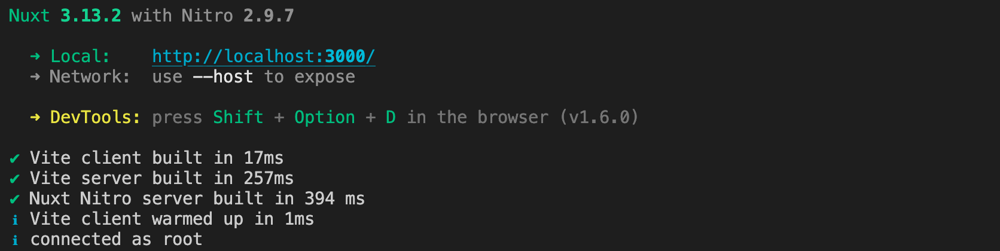
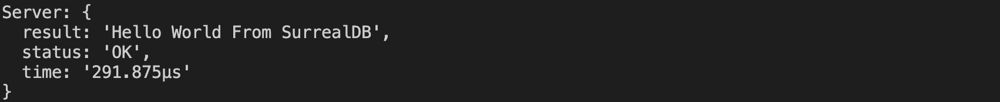

<p>
  <a href="./LICENSE"></a>
  <a href="https://nuxt.com"></a>
</p>

# Nuxt 3 Minimal Starter

Look at the [Nuxt 3 documentation](https://nuxt.com/docs/getting-started/introduction) to learn more.

## Setup

Make sure to install the dependencies (this example uses pnpm). Specifically, we install the `surrealdb.js` package.

```bash
pnpm install
```

This tutorial assumes a SurrealDB server is running on `http://localhost:8000`. We used Docker, but feel free to use another [installation method](https://surrealdb.com/docs/installation).

```bash
docker-compose up -d
```

## Development Server

Start the development server on [`localhost:3000`](http://localhost:3000):

```bash
pnpm run dev
```



### Result

Visit [`localhost:3000`](http://localhost:3000), to see the response printed on the server and browser:




## Under the code

### Server-side Connection

To connect SurrealDB on your Nuxt project server side, copy the Nitro Server Plugin from the [`.server/plugins`] directory. This code creates a single connection to SurrealDB. To use the variable, import the surrealdb variable from the plugin in your server-side code.

Since this plugin works on server-side, we can store our configuration variables as private runtime variables in the [Nuxt Config](nuxt.config.ts) and can be [overridden using environment variables](https://nuxt.com/docs/guide/going-further/runtime-config#environment-variables).

The rest of this starter kit tests this connection by returning "Hello World From SurrealDB" and displaying it on our frontend. From here, create different API routes for any additional API functionality you need.

## Contributing

See [Contribution Guidelines](./CONTRIBUTING.md).

## What Next

Check out the [deployment documentation](https://nuxt.com/docs/getting-started/deployment) to deploy on your favorite Cloud or Edge Provider.
