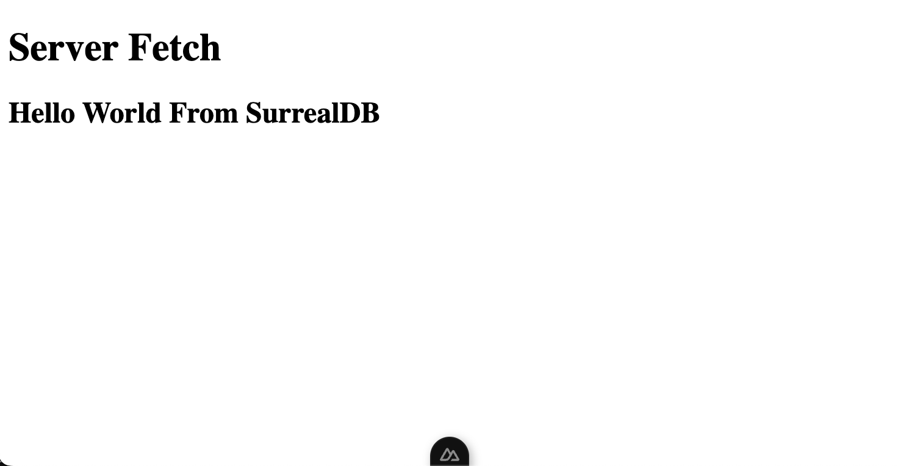

<p>
  <a href="./LICENSE"></a>
  <a href="https://nuxt.com"></a>
</p>

# Nuxt 3 Minimal Starter

## Setup

Make sure to install the dependencies (this example uses pnpm). Specifically, we install the `surrealdb.js` package.

```bash
pnpm install
```

This tutorial assumes a SurrealDB server is running at `localhost:8000`. We used Docker, but feel free to use another [installation method](https://surrealdb.com/docs/installation).

```bash
docker compose up -d
```

## Development Server

Start the development server on [`localhost:3000`](http://localhost:3000):

```bash
pnpm run dev
```


## Under the code

To connect SurrealDB on your Nuxt project, copy the Composable Code from [`./composables/surrealdb.ts`](./composables/surrealdb.ts) directory. This code handles the lifecycle with a single connection to SurrealDB.

Depending on whether you want server side communication or client side communication with your database, follow either or both of the following steps.

### Server-side Communication
To communicate to Surrealdb from the server, we create a server plugin. Copy the Nitro Server Plugin Code from [`./server/plugins/surrealdb.ts`](./server//plugins//surrealdb.ts). Since this plugin works on server-side, we can store our configuration variables as private runtime variables in the [Nuxt Config](nuxt.config.ts) which can be [overridden using environment variables](https://nuxt.com/docs/guide/going-further/runtime-config#environment-variables).

The rest of this starter kit tests the connection by returning "Hello World From SurrealDB" and displaying it on our frontend. 

### Result

Visit [`localhost:3000`](http://localhost:3000), to see the response printed on the server and browser:

```text
Server: Hello World From SurrealDB
```


### Client-side Connection

The client-side connection example requires authentication on the client before requesting data from the database. The code inside [`./pages/client.vue`](./pages/client.vue) provides SignUp and SignIn functionality using the Access Authentication method from SurrealDB. The provided access token can then be used to get data from the database directly from the client.

### Result

Visit [`localhost:3000/client`](http://localhost:3000/client), to see the example in action.


## Contributing

See [Contribution Guidelines](./CONTRIBUTING.md).

## What Next

From here, create different API routes for any additional API functionality you need.

Look at the [Nuxt 3 documentation](https://nuxt.com/docs/getting-started/introduction) to learn more.

Check out the [deployment documentation](https://nuxt.com/docs/getting-started/deployment) to deploy on your favorite Cloud or Edge Provider.
